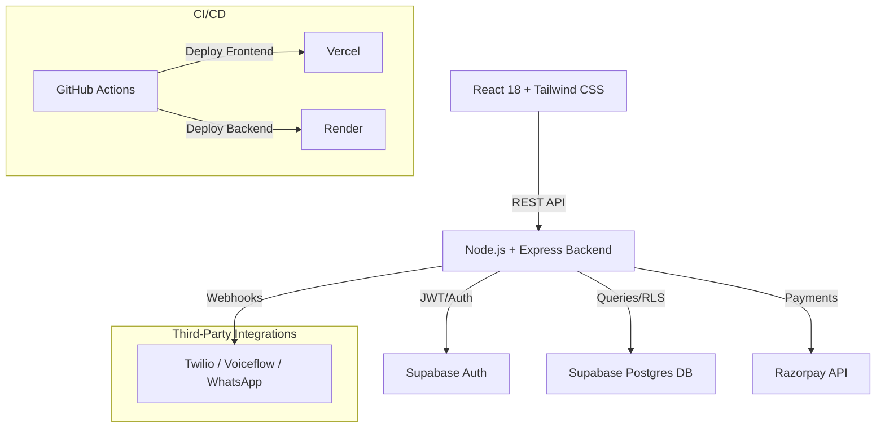

# LeadOS Phase 1 Implementation Plan

## Architecture Diagram


## Database Schema (Supabase Postgres)

Every table includes `id` (UUID, primary key), `org_id` (UUID), `created_at` (TIMESTAMPTZ), and `updated_at` (TIMESTAMPTZ).
Row-Level Security (RLS) handles `org_id` isolation.

1. **orgs**
   - id (UUID)
   - org_id (UUID) - Self-referencing or matching id for consistency
   - name (VARCHAR)
   - domain (VARCHAR)
   - created_at (TIMESTAMPTZ)
   - updated_at (TIMESTAMPTZ)

2. **users**
   - id (UUID) - References auth.users
   - org_id (UUID) - References orgs.id
   - email (VARCHAR)
   - role (VARCHAR) - 'admin' | 'manager' | 'agent'
   - full_name (VARCHAR)
   - created_at, updated_at

3. **leads**
   - id, org_id
   - name (VARCHAR)
   - email (VARCHAR)
   - phone (VARCHAR)
   - status (VARCHAR)
   - created_at, updated_at

4. **lead_notes**
   - id, org_id
   - lead_id (UUID) - References leads.id
   - author_id (UUID) - References users.id
   - content (TEXT)
   - created_at, updated_at

5. **posts**
   - id, org_id
   - title (VARCHAR)
   - content (TEXT)
   - platform (VARCHAR) - 'facebook' | 'instagram' | 'linkedin'
   - status (VARCHAR) - 'draft' | 'scheduled' | 'published'
   - created_at, updated_at

6. **approvals**
   - id, org_id
   - entity_type (VARCHAR) - e.g., 'post', 'template'
   - entity_id (UUID)
   - requested_by (UUID) - References users.id
   - status (VARCHAR) - 'pending' | 'approved' | 'rejected'
   - created_at, updated_at

7. **call_logs**
   - id, org_id
   - lead_id (UUID)
   - agent_id (UUID)
   - duration_seconds (INT)
   - transcript (TEXT)
   - created_at, updated_at

8. **subscriptions**
   - id, org_id
   - plan_id (VARCHAR)
   - razorpay_subscription_id (VARCHAR)
   - status (VARCHAR) - 'active' | 'past_due' | 'canceled'
   - current_period_end (TIMESTAMPTZ)
   - created_at, updated_at

9. **prompt_templates**
   - id, org_id
   - name (VARCHAR)
   - system_prompt (TEXT)
   - variables (JSONB)
   - created_at, updated_at

10. **usage_logs**
    - id, org_id
    - feature (VARCHAR) - e.g., 'ai_assistant', 'blast_email'
    - tokens_used (INT)
    - user_id (UUID)
    - created_at, updated_at

## Complete API Route List

### Auth
- `POST /auth/signup` - Register a new user and potentially a new org
- `POST /auth/login` - Authenticate user and return JWT (via Supabase)

### Leads
- `GET /leads` - Get all leads for the org
- `POST /leads` - Create a new lead
- `PUT /leads/:id` - Update an existing lead
- `DELETE /leads/:id` - Delete a lead

### Lead Notes
- `GET /leads/:id/notes` - Get notes for a specific lead
- `POST /leads/:id/notes` - Add a note to a specific lead

### Approvals
- `POST /approvals` - Create a new approval request
- `PUT /approvals/:id` - Update approval status (approve/reject)

### Webhooks
- `POST /webhook/twilio` - Receive voice/SMS updates from Twilio
- `POST /webhook/voiceflow` - Receive conversation updates from Voiceflow
- `POST /webhook/whatsapp` - Receive chat updates from WhatsApp

### Billing
- `POST /billing/trial` - Start a trial subscription
- `POST /billing/webhook` - Receive events from Razorpay

### System
- `GET /health` - Health check endpoint returning `{ status: "ok" }`

## Backend Folder Structure

```text
/backend
├── .env.example
├── index.js                 # Express app initialization & server entry point
├── package.json
├── /config                  # Configuration files
│   └── supabase.js          # Supabase client setup
├── /migrations              # Supabase DB schema and CRM policies
│   ├── 001_init.sql         # Base 10 tables definition
│   └── 002_rls.sql          # RLS policies requiring and validating org_id
├── /middleware              # Request handlers
│   ├── auth.js              # JWT verification & populating req.user and req.role
│   └── tenant.js            # Validation that org_id is present and enforced
├── /routes                  # API endpoint definitions
│   ├── auth.js
│   ├── leads.js
│   ├── notes.js
│   ├── approvals.js
│   ├── webhooks.js
│   └── billing.js
└── /controllers             # Core business logic handlers
    ├── authController.js
    ├── leadController.js
    ├── notesController.js
    ├── approvalController.js
    ├── webhookController.js
    └── billingController.js
```

## User Review Required
> [!IMPORTANT]
> Please review the architecture, schemas, API routes, and folder structure above. Once approved, I will proceed to Phase 2 (Execution) beginning with repository and project setup. Prepare the environment values for `SUPABASE_URL`, `SUPABASE_ANON_KEY`, `SUPABASE_SERVICE_ROLE_KEY`, `JWT_SECRET`, `RAZORPAY_KEY_ID`, `RAZORPAY_KEY_SECRET`, `FRONTEND_URL`, `BACKEND_URL`.
